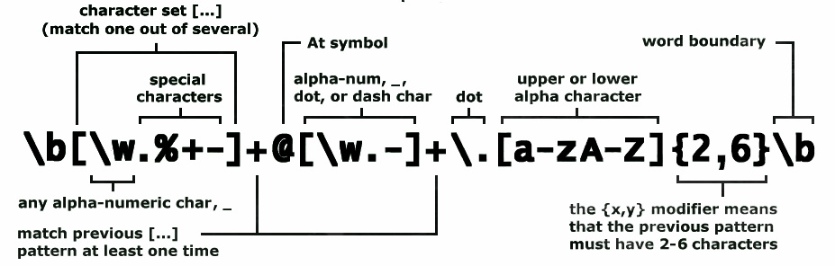

RegExp base usage
===========
-----------
Как только впервые сталкиваешься с регулярными выражениями возникает ступор и ощущение, что эта технология не для простых людей. Однако если копнуть глубже и разораться в теме то все становиться просто и понятно.

### Для чего нужны регулярки:

В основном регулярные выражения используются для поиска по информации в тектсте по шаблону. И/или замене валидации удалению текста.

Немного информации о том, как использовать регулярные выражения с примерами.

### Где можно использовать

 Практически любой язык программирования поддерживает операции над строками с использованием регулярных выражкний. 
Но мало кто использует данную возиожность при обработке данных в текстовых редактрах. Например VSCode.
Использование помогает автоматизировать обрабокту текста. А иногда поиск некоторых паттернов и вовсе нереален без использования регулярныъ выражений.
Например поиск url  в тексте.

### Как изучать
* Изучить базовые выражения
* Разобраться с группировкой
* Разобраться с квантификаторами

### Базовые выражения

В регулярных выражениях поиск в строке осуществляется по определенным шаблонам.
Ниже приведен список выражений данных шаблонов.

| Выражение | Что делает |
|-----------|--------------|
|.|любой один символ|
|\\ |не учитывать специальные значения символов (используется для экранирования символа +,-,. и т.д.)|
|[...]|соответствовать символам, приведенным внутри этих квадратных скобок|
|-|задается период (к примеру [1-9])|
|^|не соответствует приведенному после этого символа (но работает только в квадратных скобках [^1-9])|
|^|обязательно должно начинаться со следующих после ^ символов|
|$|обязательно должно заканчиваться идущими перед $ символами|
|()|сгруппировать и запомнить как группу символов|
|||ИЛИ (к примеру 1|2 – означает 1 ИЛИ 2)|
|\d|любая цифра (то же что и [0-9])|
|\D|все крое любой цифры (то же что и [^0-9])|
|\s|любой разделительный символ (пробел, таб, перевод строки)|
|\S|любой символ кроме разделительного (пробел, таб, перевод строки)|
|\w|любая буква, цифра или нижнее подчеркивание (тоже что и [A-Za-z0-9_]).|
|\W|все кроме любой буквы, цифры или нижнего подчеркивания (тоже что и [^A-Za-z0-9_]).|
|\b|границы слова|
|\B|все кроме границы слова|

### Квантификаторв
| Выражение | Что делает |
|-----------|--------------|
|?|соответствует нулю или одному из предыдущих символов (21? соответствует 2, 21)|
|+|соответствует одному или более из предыдущих символов (21+ соответствует 21, 211, 2111 и т.д.)|
|\*|соответствует нулю или более из предыдущих символов (21* соответствует 2, 21, 211, 2111 и т.д.)|
|{минимум,максимум}|21{2} – 211. Не соответствует 2, 21, 2111. 21{1,3} – 21, 211, 2111. Не соответствует 2, 21111|

Примеры
---
[Преобразование скоприованного текста](examples/copy-example.md) 
[Объединение списка в массив](examples/list-to-join-example.md) 
[Проверка телефона](examples/phonenumber-example.md) 
[Использование в Qt](examples/qt-regexp.md) 

---
### Ссылки
[https://regex101.com](https://regex101.com) - Самая важная ссылка! Тут можно попробовать и проверить выражение под разные языки. 
[regexp-security-cheatsheet](https://github.com/attackercan/regexp-security-cheatsheet) - some information to replace regullar regexp characters to secure
